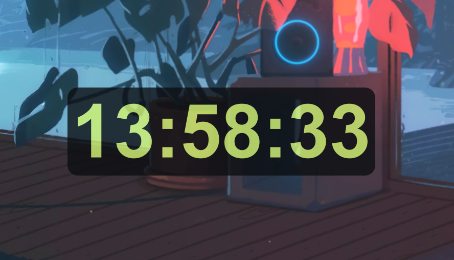

**Read this in other languages: [English](README.md).**

# 桌面时钟

这是一个简洁、美观的桌面时钟。  



## 说明

1.桌面时钟基于Python3和Qt6开发，上传的文件包含TKinter版本。  
2.快速改变并保存颜色，大小，模式等。  
2.Qt6支持Windows10-11，不支持Windows XP。  
3.磨砂玻璃圆角背景尚未实现，但是api已经放在`my_window_effect.py`文件中。  

## 运行环境

1.桌面系统(WIN10+)  
Windows 11 专业版 23H2  

2.Python版本(3.7+)  
Python3.7.4 64-bit  

3.第三方库：PySide6  
``pip install pyside6``

## 用法

### 基本用法

1.鼠标左键按住进行拖拽  
2.鼠标左键双击切换字体颜色  
3.鼠标中键单击切换是否置于顶层  
4.鼠标右键双击退出程序  

### 配置文件
```
x：组件与屏幕左边的距离。  
y：组件与屏幕顶部的距离。  
isontop：组件是否置顶。  

font：设置字体。  
fontsize：设置字号，影响组件显示大小。  
isbold：设置文字加粗。  
color：设置文字颜色。  
background：设置组件背景颜色。  

opacity：设置组件透明度。  
isframe：设置是否显示边框。  
```
